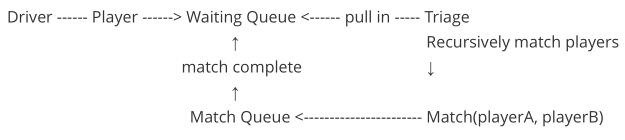

Synopsis
========

Installation Requirements
-------------------------

SBT/Scala setup or Mac (apologies to everyone else). Firstly you will need
[homebrew](https://brew.sh/):

```bash
$ /usr/bin/ruby -e "$(curl -fsSL https://raw.githubusercontent.com/Homebrew/install/master/install)"
```

-   Install **JDK** (Java)

-   Install **sbt** (Scala)

```bash
$ brew install homebrew/cask/java
$ brew cask info java
```

```bash
$ brew install sbt
$ brew info sbt
```

Scala
-----

**Test**

```bash
$ sbt test
```

**Run**

There is one driver/main object to run this application:

```bash
$ sbt run
```

**Run debug**

```bash
$ sbt '; set javaOptions += "-Dlog.level=debug"; run'
```

Some other debug options have been added to watch the driver app in action -without these the log output would be overwhelming, and so these options basically slow things down (whether it is a good idea to mix in debug code with
actual code is certainly debatable, but for demo purposes it was added).

```bash
$ sbt '; set javaOptions ++= Seq("-Dlog.level=debug", "-Dplayers.per.tick=2", "-Dgames.expire.ratio.per.tick=3"); run'
```

Appendum
--------

The approach that unfolded involved a scheduler issuing new players onto a queue which was periodically emptied into a **triage** of *waiting* players that couldbe **matched**. Upon a **match** an event would be fired to a queue of matches which again are periodically reduced by **completing** matches meaning theplayers would once again be waiting for another match. The [spec](introduction.md) mentions the idea of a player being in either a**Waiting** or **Playing** state. However, as the fold evolved, these states seemed redundant, as a player is either in the waiting queue; in triage (where they could be selected for a match); or are in a game i.e. the match queue.



